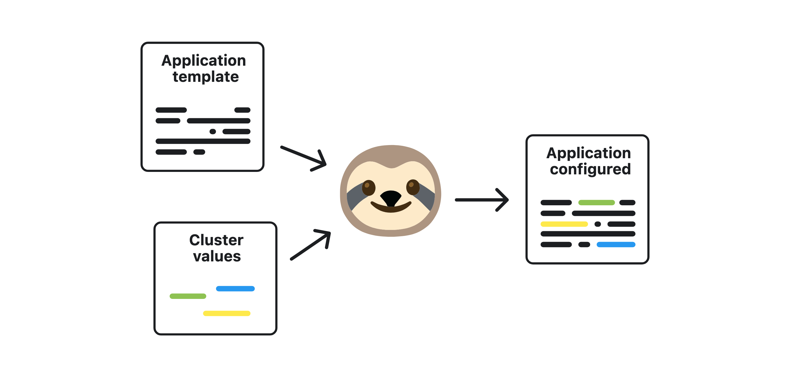
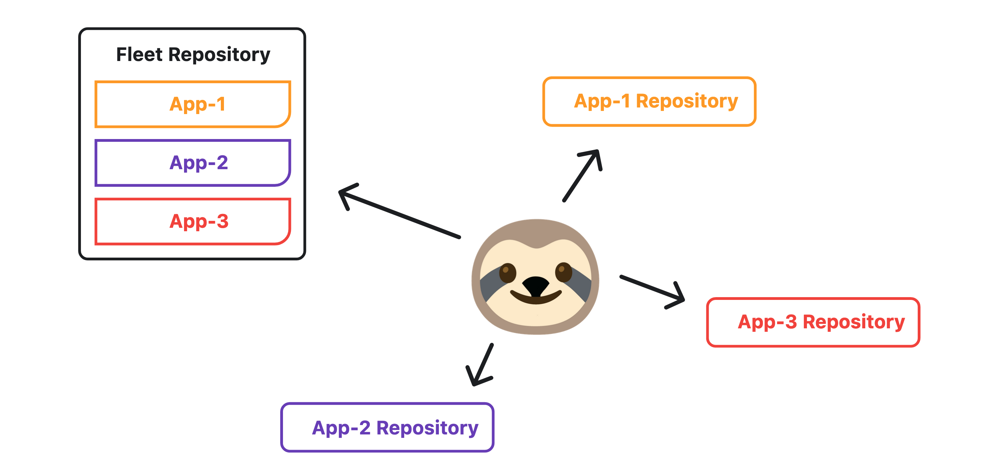
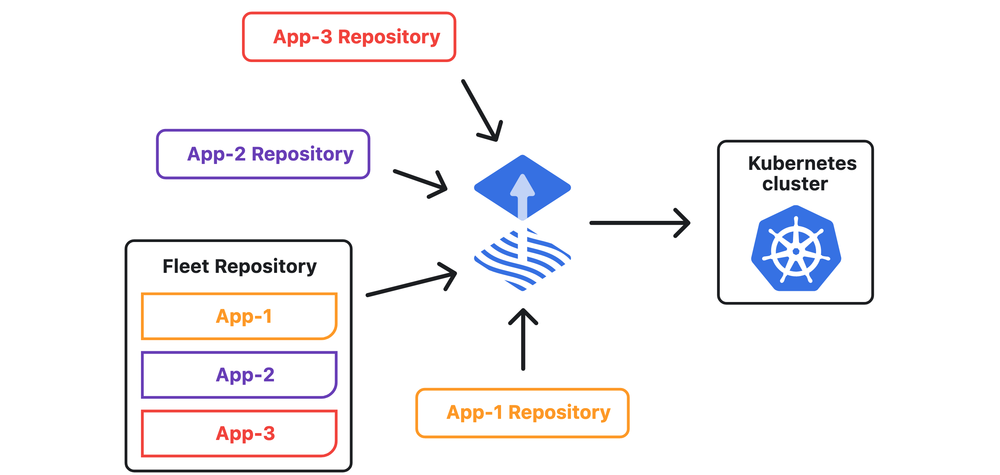

<p align="center">
    
</p>

<h1 align="center">Lizz</h1>

<p align="center"><b>Lizz</b> is a CLI to facilitate the creation of a <a href="https://fluxcd.io/">Flux2</a> managed k8s cluster and the deployment of applications.</p>


## Concepts

Lizz automatically configures the application according to the cluster in which it will be added.



Lizz creates and manages the Git repositories following the multi-tenant GitOps structure.



Lizz doesn’t interact with the Kubernetes cluster directly, the manifest files in the Git repositories are deployed in the cluster using [Flux2](https://fluxcd.io/) as GitOps tool.



## Installation

The `lizz` command-line-interface (CLI) is used to generate and organize the Git repositories.

To install the CLI with Homebrew run:

```
brew install openlizz/tap/lizz
```

For other installation methods, see the [installation guide](https://openlizz.com/docs/installation).

## Get Started with Lizz

This tutorial shows you how to initialize a Lizz cluster, setup the secrets management, and deploy a sample application using Lizz.

### Before you begin

Lizz works together with [Flux](https://fluxcd.io) that is a GitOps tool in charge of keeping in sync the cluster states and the Git repositories.
See the [Flux installation page](https://fluxcd.io/flux/installation/) in the documentation to install it in your machine.

To follow this tutorial, you will also need:

- **A Kubernetes cluster**. We recommend [Kubernetes kind](https://kind.sigs.k8s.io/docs/user/quick-start/) for trying Lizz out in a local development environment.
- **A GitHub personal access token with repo permissions**. See the GitHub documentation on [creating a personal access token](https://help.github.com/en/github/authenticating-to-github/creating-a-personal-access-token-for-the-command-line).
- **The `kubectl` CLI**. To install `kubectl` see the upstream [kubectl installation docs](https://kubernetes.io/docs/tasks/tools/install-kubectl/).

### Check everything is installed

At this step, you should have the `flux`, the `lizz`, and the `kind` CLIs installed.
Check you have everything needed by running the following commands:

```
flux --version && lizz --version && kind --version && kubectl version --client
```

The output shoud be similar to:

```
flux version 0.33.0
lizz version 0.0.1
kind version 0.14.0
Client Version: version.Info{Major:"1", Minor:"25", GitVersion:"v1.25.0", GitCommit:"a866cbe2e5bbaa01cfd5e969aa3e033f3282a8a2", GitTreeState:"clean", BuildDate:"2022-08-23T17:36:43Z", GoVersion:"go1.19", Compiler:"gc", Platform:"darwin/arm64"}
Kustomize Version: v4.5.7
```

### Export your credentials

Export your GitHub personal access token and username:

```bash
export GITHUB_TOKEN=<your-token>
export GITHUB_USER=<your-username>
```

### Create the Kubernetes cluster locally

You can now create the Kubernetes cluster locally using the following command:

```
kind create cluster
```

You can check your Kubernetes cluster and that you have everything needed to run Flux by running:

```
flux check --pre
```

The output is similar to:

```
► checking prerequisites
✔ Kubernetes 1.24.0 >=1.20.6-0
✔ prerequisites checks passed
```

### Create the fleet repository

Lizz organizes the repositories in the multi-tenant way.
This means each tenant (or application in the context of Lizz) has its repository and a limited access to the cluster.
The platform admin repository which contains information about the cluster and the tenants is called the fleet repository.

For more information about managing multi-tenant clusters with Git and Flux, you can have a look to [this GitHub repository](https://github.com/fluxcd/flux2-multi-tenancy).

The following command creates the fleet repository with the correct structure and content for Lizz and Flux:

```
lizz init github \
  --owner=$GITHUB_USER \
  --destination=fleet \
  --origin-url=https://github.com/openlizz/fleet \
  --personal
```

You should see the following output:

```
Initialize the cluster repository...
 ✓ Clone the cluster repository
 ✓ Create a new configuration for the cluster
 ✓ Create new repository
 ✓ Commit and push to the cluster repository
```

### Install Flux in your cluster

For information about Flux and the bootstrap options, see the [Flux documentation](https://fluxcd.io/flux/installation/#bootstrap).

Run the bootstrap command:

```
flux bootstrap github \
  --owner=$GITHUB_USER \
  --repository=fleet \
  --branch=main \
  --path=cluster \
  --personal
```

The output is similar to:

```
► connecting to github.com
► cloning branch "main" from Git repository
✔ cloned repository
► generating component manifests
✔ generated component manifests
✔ committed sync manifests to "main"
► pushing component manifests
► installing components in "flux-system" namespace
✔ installed components
✔ reconciled components
► determining if source secret "flux-system/flux-system" exists
► generating source secret
✔ public key: xxx
✔ configured deploy key "flux-system-main-flux-system-./cluster"
► applying source secret "flux-system/flux-system"
✔ reconciled source secret
► generating sync manifests
✔ generated sync manifests
✔ committed sync manifests to "main"
► pushing sync manifests
► applying sync manifests
✔ reconciled sync configuration
◎ waiting for Kustomization "flux-system/flux-system" to be reconciled
✔ Kustomization reconciled successfully
► confirming components are healthy
✔ helm-controller: deployment ready
✔ kustomize-controller: deployment ready
✔ notification-controller: deployment ready
✔ source-controller: deployment ready
✔ all components are healthy
```

The bootstrap command above does following:

- Adds Flux component manifests to the repository
- Deploys Flux Components to your Kubernetes Cluster
- Configures Flux components to track the path /cluster/ in the repository

### Configure Kubernetes secrets management

In order to store secrets safely in public or private Git repositories, Lizz uses Mozilla’s [SOPS](https://github.com/mozilla/sops).

Run the following command to configure secret management:

```
lizz secret-management github --owner=$GITHUB_USER --fleet=fleet
```

The output is similar to:

```
Configure secret management...
 ✓ Clone the cluster repository
 ✓ Open and read the cluster configuration file
 ✓ Configure the secret management
 ✓ Commit and push to the cluster repository
Run `kubectl apply -f secret.yaml` to apply the secret to the cluster
```

This command generates the `secret.yaml` file which contains the [age](https://github.com/FiloSottile/age) private key used to decrypt secrets.
You need to store the private key in your Kubernetes cluster by running:

```
kubectl apply -f secret.yaml
```

Keep safe the private key or the `secret.yaml` file as this is the **only** way to decrypt the secrets stored in the Git repositories.
You will need this key in case of a disaster to restore your cluster.

### Add your first application

Let's add the [Homer](https://github.com/Openlizz/application-homer) application to your cluster.
Homer is a [very simple static homepage](https://github.com/bastienwirtz/homer).

You can add it to the cluster with the following command:

```
lizz add github \
--owner=$GITHUB_USER \
--fleet=fleet \
--origin-url=https://github.com/openlizz/application-homer \
--path=./default \
--destination=homer \
--personal
```

The output is similar to:

```
Add new application...
 ✓ Clone the application repository
 ✓ Clone the cluster repository
 ✓ Open and read the cluster configuration file
 ✓ Render the application configuration
 ✓ Check that the application can be installed
 ✓ Render the application values
 ✓ Encrypt the application files
 ✓ Create new repository
 ✓ Commit and push to the application repository
 ✓ Add the application to the cluster repository
 • public key: ecdsa-sha2-nistp384 AAAAE2VjZHNhLXNoYTItbmlzdHAzODQAAAAIbmlzdHAzODQAAABhBAVrxEgzynfwhYKF963OPAZAdTfFVccjOJGb0LnW8ra+OhLoyVXcohplWfC5WNL5GQKG2ptbolTaacUH+Tsg7ZNnHKN/ssPMdKUn83gwS7wMMxJcmHVX5txA0Fl3+FAnwg==
 • configured deploy key "sourcesecret-main" for "https://github.com/$GITHUB_USER/homer"
 ✓ Commit and push to the cluster repository
```

This command creates a new repository for the application and update the fleet repository to include the new application.

To actually deploy the application in your Kubernetes cluster, you need to run:

```
flux reconcile source git flux-system
```

The output should be:

```
► annotating GitRepository flux-system in flux-system namespace
✔ GitRepository annotated
◎ waiting for GitRepository reconciliation
✔ fetched revision main/ca1af5814ca6bf4884861f0b01b1ec9bc97c186b
```

You can check that the pod is running with:

```
kubectl -n homer get pod
```

After a couple of seconds, you should see something similar to:

```
NAME                     READY   STATUS    RESTARTS   AGE
homer-6f7b7647d6-fbckg   1/1     Running   0          11m
```

You can access the homepage by running `kubectl -n homer port-forward svc/homer 8080:8080` and accessing [localhost:8080](http://localhost:8080/).
You should see something similar to:


### Conclusion

In this tutorial, you have seen how to setup your cluster to work with Lizz in a multi-tenant GitOps setup powered by Flux.

To continue to discover Lizz and its power, you can have a look to [the full documentation](https://openlizz.com).